# Relay

**Relay** is a role-based project delivery platform for engineering teams. It replaces the usual sprawl of Jira dashboards, spreadsheets, and tribal knowledge with a single application that gives **developers**, **managers**, and **admins** a live, role-specific view of the same underlying project — and lets anyone on the team *ask it questions in plain English* and get a cited answer pulled from the project's own Jira tickets, GitHub commits, and SOW/PM documents.

It was built for real delivery pain points: knowledge that leaves with a departing developer, scope creep that goes unnoticed until a client escalates, and the hours managers spend manually compiling a status update from four different tools.

> Looking for the deployment runbook instead of an overview? See [`docs/DEPLOY.md`](docs/DEPLOY.md).

---

## Table of contents

- [Overview](#overview)
- [Key features](#key-features)
- [Tech stack](#tech-stack)
- [Architecture](#architecture)
- [Repository structure](#repository-structure)
- [Getting started](#getting-started)
- [Environment variables](#environment-variables)
- [API reference](#api-reference)
- [Deployment](#deployment)
- [Screenshots](#screenshots)
- [Known issues & limitations](#known-issues--limitations)
- [Contributing / workflow](#contributing--workflow)
- [License](#license)

---

## Overview

Relay is a **TanStack Start (React) frontend** backed by a **FastAPI service** that together answer three questions for an engineering delivery engagement:

1. **"What's the state of this project, right now?"** — dashboards computed live from Jira and GitHub, not a manually updated status doc.
2. **"Why was this decision made, and what changed?"** — a retrieval-augmented chat ("Ask Project") that answers from the project's own indexed history, with citations, and an honest "I don't know" instead of a hallucinated answer.
3. **"How do we hand this off cleanly?"** — generated onboarding kits (for a new hire) and handover kits (for someone leaving), plus a project-scoped scratchpad so institutional knowledge doesn't live only in one person's head.

Every screen is scoped by **role** (developer / manager / admin) and by **project staffing** — a developer sees the project(s) they're actually assigned to, not every engagement in the system, and every backend endpoint enforces that server-side, not just in the UI.

## Key features

**Developer**
- Personal work dashboard: assigned tickets, sprint coverage, open PRs
- **Ask Project** — chat with the project's own data
- Personal **Scratchpad** for notes, with auto-draft suggestions distilled from PR activity
- Self-serve **Onboarding Kit**: orientation, access & setup, glossary, who-to-ask, a first suggested ticket

**Manager**
- Team dashboard: ticket coverage, sprint burndown, per-developer workload breakdown, risk signals
- **Team overview** with individual developer drill-down and audit trail
- **Handover Kit** builder for a developer who is leaving (ticket reassignment, leave tracking)
- **Onboarding Kit** builder for a new hire joining their project
- **Scope Guardian** — SOW-vs-ticket classification surfaced as in-scope / out-of-scope / ambiguous, with alerts
- **PM Documents** — upload and review pipeline for the 11 standard PM artifact types (Charter, BRD/PRD, Change Requests, Status Reports, etc.), auto-classified and made searchable by Ask Project once confirmed

**Admin**
- Every project across the organization, not just one engagement
- **Project setup wizard**: Jira/GitHub connection, governance, staffing, SOW upload and deliverable extraction
- **User management**: invite users, assign roles, see project assignment and last-active status
- **Knowledge base** and system **configuration** (connected sources, active LLM provider)

**Platform-wide**
- Live **Jira + GitHub sync** — a background poller keeps indexed data current on a schedule, not on manual re-ingestion
- **Scope Guardian** classification pipeline
- Shared **PostgreSQL + pgvector** search across every ingested source (tickets, commits, PRs, SOW text, PM documents)

## Tech stack

| Layer | Technology |
|---|---|
| **Frontend framework** | [TanStack Start](https://tanstack.com/start) (SSR meta-framework on top of Vite/Nitro) + [TanStack Router](https://tanstack.com/router) (file-based routing) |
| **UI** | React 19, Tailwind CSS v4, Radix UI primitives, shadcn-style component library (`src/components/ui`), Recharts (charts), Lucide icons |
| **Forms & validation** | React Hook Form + Zod |
| **Frontend auth** | `jsonwebtoken` (HS256) for session cookies and short-lived API tokens, `bcryptjs` for password hashing |
| **Frontend data layer** | Prisma ORM (auth/user/session tables) |
| **Backend framework** | [FastAPI](https://fastapi.tiangolo.com/) (Python 3.11) on Uvicorn |
| **Backend auth** | PyJWT — verifies the same HS256 tokens the frontend signs |
| **Database driver** | `asyncpg` (raw SQL, connection-pooled) |
| **Database** | PostgreSQL with the `pgvector` extension ([Neon](https://neon.tech) serverless Postgres in production) |
| **Embeddings** | `sentence-transformers`, model `BAAI/bge-small-en-v1.5` (384-dim) |
| **LLM providers** | Ordered fallback chain — [Cerebras](https://cloud.cerebras.ai) → [Google Gemini](https://ai.google.dev) → [Groq](https://groq.com) → [OpenRouter](https://openrouter.ai) |
| **External integrations** | Jira Cloud REST API, GitHub REST API |
| **Hosting** | Vercel (frontend), Render (backend, Docker), Neon (database) |
| **CI / keep-alive** | GitHub Actions (`.github/workflows/keepalive.yml`) |

## Architecture

Relay runs as **two separately deployed services sharing one Postgres database**, not a monolith:

- **Frontend (Vercel)** — TanStack Start, running as a Node SSR service. Owns login, session cookies, and the Prisma-managed `User`/`Session` tables. It never talks to Jira, GitHub, or an LLM directly.
- **Backend (Render)** — FastAPI, running as a Docker container. Owns everything else: the Jira/GitHub live sync, the Ask Project RAG pipeline, Scope Guardian, and every project/team/analytics endpoint. It is called directly from the browser, not proxied through the frontend server.
- **Database (Neon)** — one Postgres instance both services connect to. Prisma migrations own the `User`/`Session` tables; a set of hand-applied SQL files (`database/*.sql`, tracked and applied by `backend/scripts/apply_migrations.py`) own everything else.

```
                              ┌─────────────────────────────┐
                              │           Browser            │
                              └───────────┬──────────┬──────┘
                                          │          │
                    session cookie (30d) │          │ Authorization: Bearer <15-min JWT>
                                          ▼          ▼
                     ┌───────────────────────────┐   ┌───────────────────────────────┐
                     │  Vercel — TanStack Start   │   │   Render — FastAPI (Docker)    │
                     │  • login / session cookie  │   │  • require_user / require_role │
                     │  • mints short-lived API   │   │  • Ask Project RAG pipeline    │
                     │    tokens (same JWT_SECRET)│   │  • Jira + GitHub live sync     │
                     │  • Prisma (User, Session)  │   │  • Scope Guardian              │
                     └─────────────┬──────────────┘   │  • analytics / project APIs    │
                                   │                   └───────┬───────────┬───────────┘
                                   │                           │           │
                                   ▼                           ▼           ▼
                     ┌─────────────────────────────────────────────┐  ┌─────────┐  ┌────────────────┐
                     │        Neon Postgres (+ pgvector)            │  │  Jira   │  │ GitHub /       │
                     │  public.User, public.Session   (Prisma)      │  │  Cloud  │  │ LLM providers   │
                     │  public.projects, project_staffing, chunks…  │  │  API    │  │ (Cerebras/      │
                     │  zone1 (raw) · zone2 (chunks) · zone3 (chat, │  └─────────┘  │  Gemini/Groq/   │
                     │  scratchpad)          (hand-applied SQL)     │               │  OpenRouter)    │
                     └───────────────────────────────────────────────┘               └────────────────┘
```

**Auth flow.** A user logs in against Prisma's `User` table (bcrypt). That mints a 30-day httpOnly session cookie the frontend server reads on every request. Because the browser calls the Render backend *directly* (not through the frontend server), it needs its own credential: the frontend mints a separate, short-lived (15-minute) JWT signed with the same `JWT_SECRET`, attaches it as `Authorization: Bearer <token>`, and the FastAPI backend verifies it independently (`backend/api/auth.py`). This is why `JWT_SECRET` must be byte-for-byte identical on both Vercel and Render — a mismatch rejects every backend call as unauthenticated.

**Ask Project (RAG) pipeline.** Every ingested source — Jira tickets, GitHub commits/PRs, SOW text, confirmed PM documents — is chunked and embedded with `bge-small-en-v1.5` into `public.chunks` (pgvector). A question is embedded the same way, cosine-searched for its top 5 nearest chunks, and any chunk scoring below a 0.65 threshold is dropped. If nothing clears the bar, the system abstains rather than guessing. Surviving chunks go to the LLM fallback chain for a synthesized, cited answer. See [`backend/README.md`](backend/README.md) for the full pipeline notes and provider benchmarks.

**Live sync.** A background task in the FastAPI app (`backend/api/sync.py`, started in `main.py`'s lifespan) polls Jira and GitHub every `SYNC_INTERVAL_MINUTES` (default 5), writes raw payloads to the `zone1` schema, and re-chunks/re-embeds anything that changed into `public.chunks`. A separate task drains Scratchpad auto-draft candidates on its own schedule.

**The "three zones" data model** (see `database/zone1.sql`, `zone3.sql`, and the `public` schema tables):
- **`zone1` (raw)** — Jira/GitHub payloads exactly as the APIs returned them, plus sync bookkeeping. Never read directly by the query API.
- **`public.chunks` (search layer)** — the only thing Ask Project's vector search reads. Populated by re-processing `zone1` and other confirmed sources.
- **`zone3` (developer-private)** — Ask Project chat history and Scratchpad notes, scoped per user.
- **`public.*` (core records)** — `projects`, `project_staffing`, `sow_documents`, `pm_documents`, `onboarding_kits`, etc. — the durable business data everything else is a view over.

## Repository structure

```
.
├── src/                        # Frontend — TanStack Start app
│   ├── routes/                 # File-based routes; _authenticated.<role>.<page>.tsx
│   │                           # convention — see src/routes/README.md
│   ├── components/
│   │   ├── relay/              # App-specific components (dashboards, kits, panels)
│   │   └── ui/                 # Generic shadcn-style primitives (button, dialog, table…)
│   ├── lib/
│   │   ├── auth/               # Session cookie signing, JWT verification, route middleware
│   │   ├── admin/               # Admin-only server functions (users, projects, PM documents)
│   │   ├── mgr/ , team/         # Manager/team-scoped helpers
│   │   ├── relayApi.ts         # Shared fetch wrapper: token attachment, GET response cache
│   │   └── db.ts               # Prisma client singleton
│   ├── router.tsx, server.ts, start.ts   # TanStack Start entry points
│   └── styles.css
│
├── backend/                     # Backend — FastAPI service
│   ├── main.py                  # App entry: lifespan (DB pool, embedding model, sync loops), routers
│   ├── api/                     # One module per feature area (see API reference below)
│   ├── scripts/                 # Migration runner, seed scripts, one-off data-fix scripts
│   ├── requirements.txt, Dockerfile
│   └── README.md                # Ask Project pipeline details, local run/test instructions
│
├── prisma/
│   ├── schema.prisma            # User + Session models (Postgres)
│   ├── migrations/               # Prisma-managed migration history
│   └── seed.ts                  # Seeds 10 demo accounts across all three roles
│
├── database/
│   ├── init.sql, relay_db_dump.sql   # One-time Docker bootstrap / full snapshot (never re-applied)
│   ├── zone1.sql, zone3.sql, project_setup.sql, sow.sql, pm_documents*.sql, …  # Incremental,
│   │                                                                            idempotent migrations
│   ├── docker-compose.yml       # Local Postgres + pgvector for development
│   └── README.md                # Why and how migrations here get applied — read before adding a file
│
├── docs/
│   ├── DEPLOY.md                # Full free-tier deployment runbook (Neon + Render + Vercel)
│   ├── plans/                   # Design/planning docs written while building each feature
│   └── changelog/               # Plain-language summaries of shipped work
│
├── fixtures/                    # Mock client data used to seed a demo engagement (SOW, audits)
├── .agents/skills/              # Neon CLI/agent skill references (tooling, not app code)
├── .github/workflows/           # keepalive.yml — pings the Render backend to avoid cold sleeps
├── public/                      # Static assets (favicon, robots.txt)
├── render.yaml                  # Render Blueprint for the backend Docker service
├── vercel.json                  # Vercel build configuration for the frontend
└── package.json
```

### Backend module map (`backend/api/`)

| Module | Responsibility |
|---|---|
| `auth.py` | JWT verification (`require_user`, `require_role`), rate limiting |
| `access.py` | Staffing-based access control (`can_access`, `require_access`) |
| `query.py` | Ask Project's RAG endpoint |
| `sessions.py` | Ask Project chat session/message persistence |
| `intents.py` | Query intent routing (ticket lookup, commit lookup, general Q&A) |
| `project.py` | Team, epics, tickets, risk signals, activity — the core project-summary endpoints |
| `analytics.py` | Sprint burndown, employee breakdown, workload (manager/admin only) |
| `scope.py` | Scope Guardian classification and alerts |
| `handover.py` | Handover Kit ticket reassignment and leave tracking |
| `onboarding.py` | Onboarding Kit generation and roster |
| `scratchpad.py` | Developer scratchpad notes, versions, PR-linked auto-drafts |
| `sow.py` | SOW upload, parsing, deliverable extraction |
| `documents.py` | Generic PM-document upload/classification/review pipeline |
| `knowledge.py` | Admin knowledge base view |
| `admin_projects.py` | Project CRUD, staffing, Jira/GitHub/governance config (admin only) |
| `me.py` | The calling user's own project list |
| `sync.py` | Jira/GitHub live sync status and manual trigger |
| `jira_client.py`, `github_client.py` | Thin API clients for the two integrations |
| `llm.py` | LLM provider chain construction and fallback |

## Getting started

### Prerequisites

- **Node.js** 20+ and **[pnpm](https://pnpm.io)** — use `pnpm`, not `npm` or `bun`, to install/run the frontend. This project's dev server has a hard dependency on pnpm's `node_modules` layout; installing with a different package manager will break the SSR dev server in ways that don't show an obvious error.
- **Python 3.11+**
- **Docker** (for a local Postgres + pgvector instance) — or a [Neon](https://neon.tech) branch if you'd rather not run Postgres locally
- API keys for whichever integrations you want live locally: at least one LLM provider (Cerebras, Gemini, Groq, or OpenRouter), and optionally Jira Cloud + GitHub credentials — the app runs and demos fine without these, falling back to seeded/synthetic data where a live connection is missing

### 1. Clone and install the frontend

```bash
git clone <this-repo-url>
cd RELAY-Project-Management-Agent
pnpm install
```

### 2. Configure environment variables

```bash
cp .env.example .env
cp backend/.env.example backend/.env
```

Fill in both files — see [Environment variables](#environment-variables) below for what each key does.

### 3. Start a local database

```bash
cd database
docker compose up -d
# Load a fully seeded demo dataset (fastest way to get real data locally):
docker exec -i relay-postgres psql -U pm_user -d relay_db < relay_db_dump.sql
cd ..
```

If you'd rather start from an empty schema and apply migrations incrementally instead of loading the dump, see [`database/README.md`](database/README.md) for `apply_migrations.py`.

### 4. Set up Prisma (auth tables) and seed demo users

```bash
pnpm exec prisma migrate deploy
pnpm exec prisma generate
pnpm exec prisma db seed   # seeds 10 demo accounts — see below
```

> `prisma db seed` shells out to `bun prisma/seed.ts` (see `package.json`'s
> `prisma.seed`) — this is the one command in the project that still needs
> `bun` installed as a TypeScript runner, independent of using `pnpm` as the
> package manager everywhere else.

### 5. Run the backend

```bash
cd backend
python3 -m venv .venv
.venv/bin/pip install -r requirements.txt
.venv/bin/python -m uvicorn main:app --port 8001 --reload
```

### 6. Run the frontend

```bash
pnpm run dev
```

Open the printed local URL and sign in with one of the seeded demo accounts (password for all: `relay2026`):

| Role | Name | Email |
|---|---|---|
| Developer | Akshar | `akshar@relay.dev` |
| Manager | Adveita | `adveita@relay.dev` |
| Admin | Anya | `anya@relay.dev` |
| Developer (on leave) | Agrim | `agrim@relay.dev` |

(`prisma/seed.ts` creates 6 more accounts across the three roles for a fuller team-overview demo.)

## Environment variables

**Root `.env`** (frontend — see `.env.example`)

| Variable | Purpose |
|---|---|
| `DATABASE_URL` | Postgres connection string Prisma uses for `User`/`Session` |
| `JWT_SECRET` | Signs session cookies and short-lived API tokens — **must match `backend/.env`'s value exactly** |
| `VITE_ASK_API_URL` | URL of the FastAPI backend the browser calls directly |

**`backend/.env`** (see `backend/.env.example`)

| Variable | Purpose |
|---|---|
| `DATABASE_URL` | Postgres connection string (overrides the root one for the backend process) |
| `JWT_SECRET` | Must be byte-for-byte identical to the frontend's |
| `LLM_PROVIDER_CHAIN` | Ordered fallback list, e.g. `cerebras,gemini,groq` |
| `CEREBRAS_API_KEY` / `CEREBRAS_MODEL` | Cerebras provider |
| `GOOGLE_GEMINI_API` / `GEMINI_API_KEYS` / `GEMINI_MODEL` | Gemini provider (`GEMINI_API_KEYS` accepts a comma-separated list for automatic quota-exhaustion fallback across accounts) |
| `GROQ_API_KEY` / `GROQ_MODEL` | Groq provider |
| `OPENROUTER_API_KEY` / `OPENROUTER_MODEL` | Last-resort free-tier provider |
| `GITHUB_TOKEN` | Read access for Ask Project's live commit-diff lookups |
| `JIRA_SITE`, `JIRA_EMAIL`, `JIRA_API_TOKEN`, `JIRA_BOARD_ID` | Jira Cloud connection for sync + analytics |
| `RELAY_ENGAGEMENT_ID` | Engagement whose chunks are searched by default |
| `CORS_ORIGINS` | Comma-separated origins allowed to call the API |

## API reference

The backend exposes a REST API grouped by feature area under `backend/api/`. Representative endpoints (see [Repository structure](#backend-module-map-backendapi) above for the full module map, or the source files directly for request/response shapes):

```
POST   /api/query                              Ask Project — RAG-answered question with citations
GET    /api/project/summary                    Ticket coverage, scope %, status breakdown
GET    /api/project/team                       Team roster for an engagement
GET    /api/project/risk-signals               Blocked/out-of-scope/reopened/unassigned tickets
GET    /api/analytics/sprints                  Sprint list                       (manager/admin)
GET    /api/analytics/burndown                 Sprint burndown series             (manager/admin)
GET    /api/analytics/employee-breakdown       Per-developer to-do/in-progress/done (manager/admin)
GET    /api/scope/alerts                       Scope Guardian alerts               (manager/admin)
GET    /api/handover/kpd/tickets               Handover Kit ticket list            (manager/admin)
GET    /api/onboarding/kits, POST /kits        Onboarding Kit read/create
GET    /api/scratchpad, POST /api/scratchpad   Developer scratchpad notes
POST   /api/admin/sow/upload                   SOW upload + deliverable extraction (admin)
POST   /api/admin/documents/upload             Generic PM document upload           (admin/manager)
GET    /api/admin/projects                     Every project (admin)
GET    /api/me/projects                        The caller's own project list
GET    /health                                 Liveness + DB + model-readiness check
```

Every endpoint except `/health` and (optionally) `/api/query` requires `Authorization: Bearer <token>`; role- and staffing-gated endpoints additionally enforce `require_role(...)` / project staffing server-side.

## Deployment

Relay deploys as three free-tier services:

- **Vercel** — frontend, auto-deploys on every push to `main`
- **Render** — backend, Docker web service, auto-deploys on every push to `main`
- **Neon** — shared Postgres database

Full step-by-step setup (including the Render free-tier cold-start mitigation and the GitHub Actions keep-alive workflow) lives in **[`docs/DEPLOY.md`](docs/DEPLOY.md)** — start there for anything deployment-related.

## Screenshots

### Developer

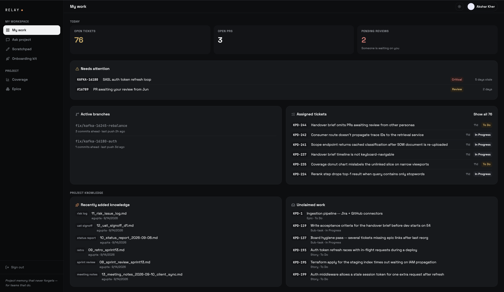
_My Work — assigned tickets, open PRs, pending reviews, active branches, and recently added project knowledge, all scoped to the signed-in developer._

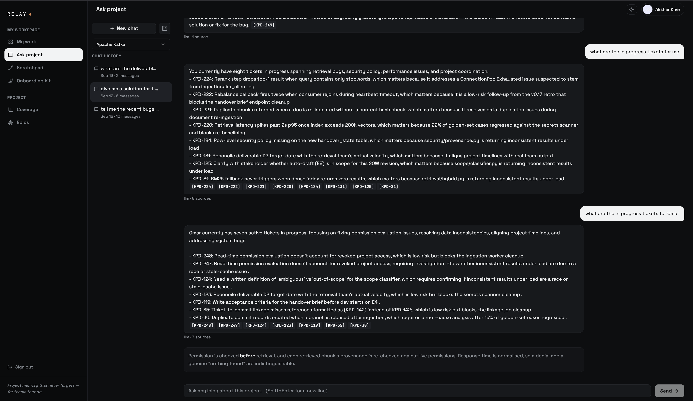
_Ask Project — a cited, conversational answer synthesized from the project's own Jira tickets ("what are the in-progress tickets for me / for Omar"), with source ticket IDs attached to every claim._

### Manager

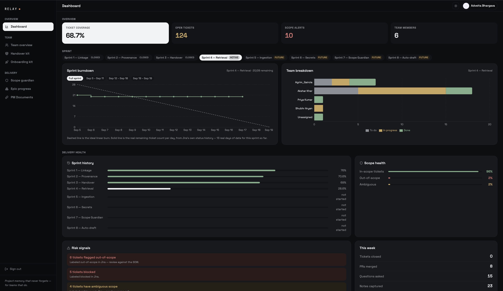
_Dashboard — ticket coverage, open tickets, scope alerts, sprint burndown vs. the ideal burn, per-developer workload breakdown, sprint history, scope health, and risk signals, all computed live from Jira._

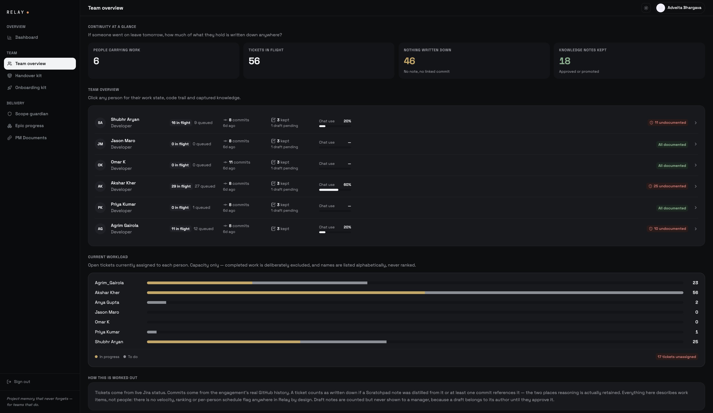
_Team overview — "if someone went on leave tomorrow, how much of what they hold is written down anywhere": per-person in-flight work, commit activity, and knowledge-capture percentage, plus a current-workload breakdown across the team._

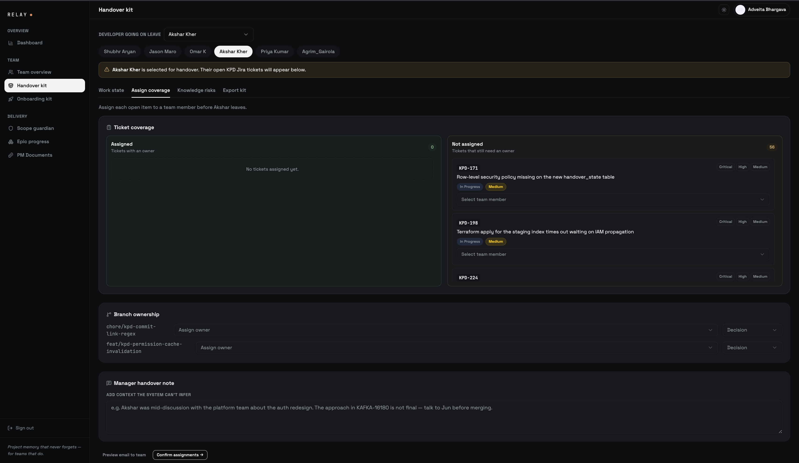
_Handover Kit — reassigning a departing developer's open tickets and branch ownership before they leave, with a manager note for context the system can't infer._

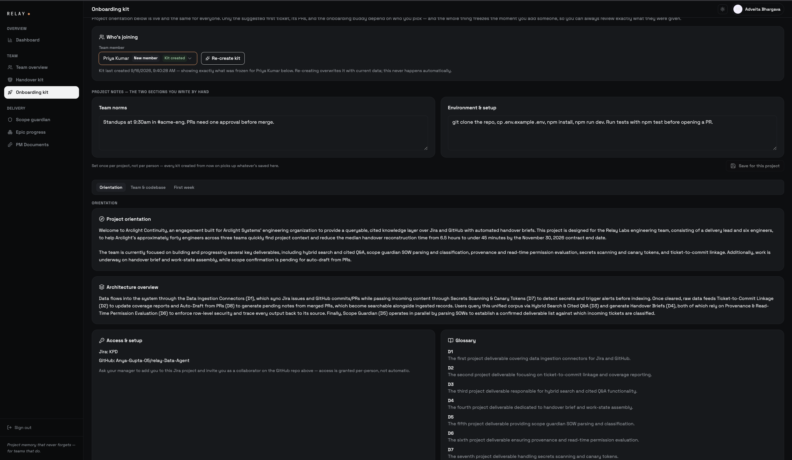
_Onboarding Kit (1/3) — who's joining, manager-authored team norms and environment setup, and the live-generated project orientation, architecture overview, access instructions, and glossary._

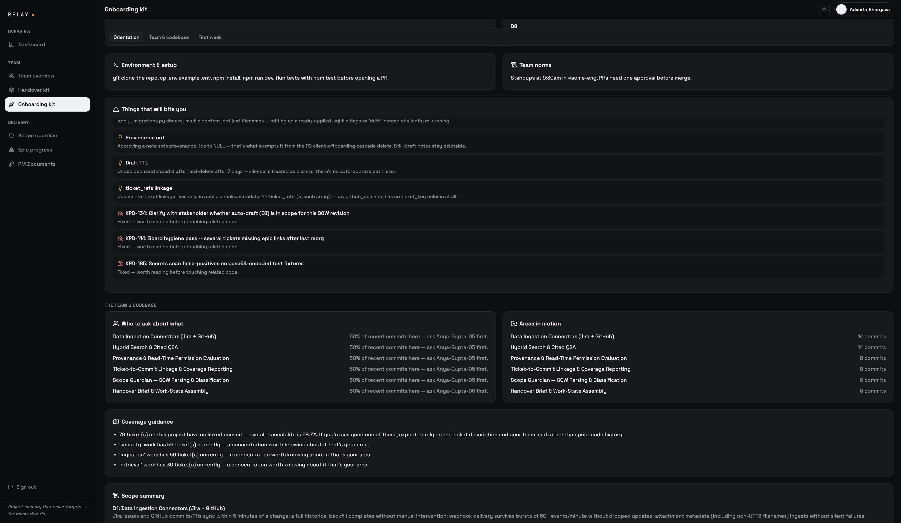
_Onboarding Kit (2/3) — "things that will bite you" (real gotchas pulled from resolved tickets), who to ask about which area based on recent commit activity, and coverage guidance._

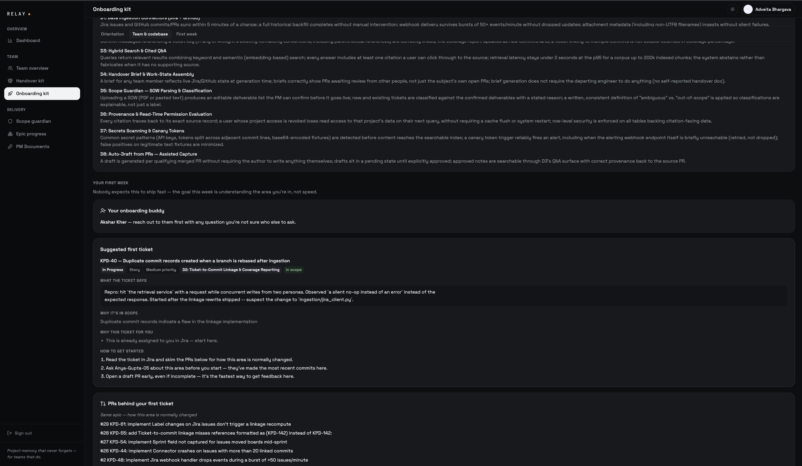
_Onboarding Kit (3/3) — per-deliverable scope definitions, an assigned onboarding buddy, and a suggested first ticket with the reasoning and related PRs behind the recommendation._

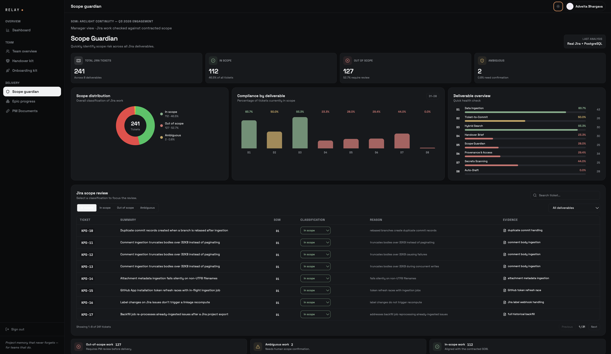
_Scope Guardian — every Jira ticket classified in-scope / out-of-scope / ambiguous against the signed SOW, broken down by deliverable, with a per-ticket reason and evidence trail._

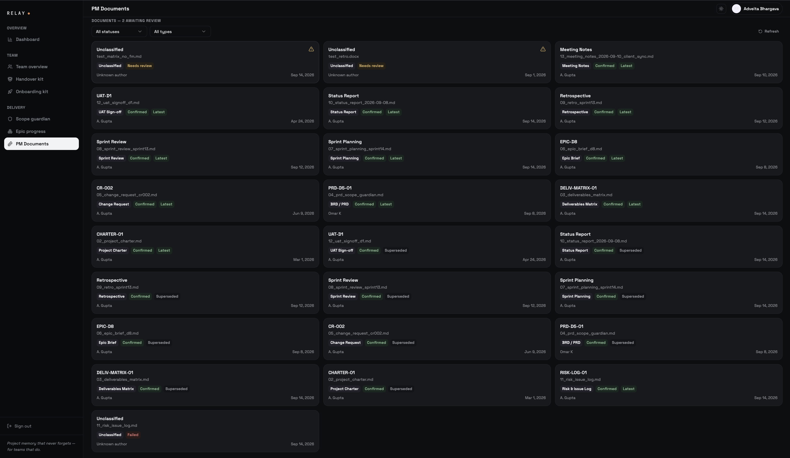
_PM Documents — the upload and classification queue across all 11 PM document types, with review status and version history (Latest / Superseded)._

### Admin

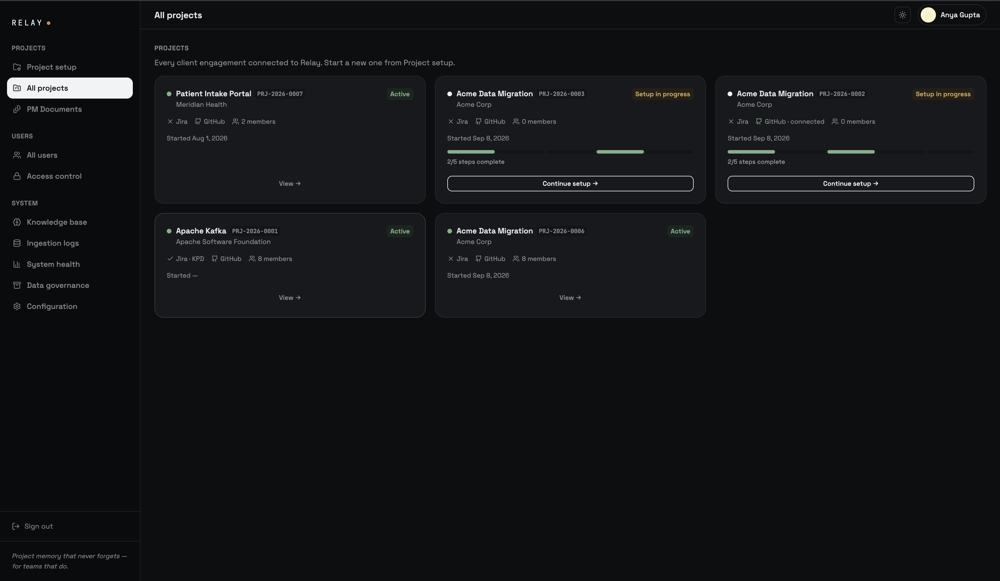
_All Projects — every client engagement connected to Relay, including in-progress setup wizards and their Jira/GitHub connection status._

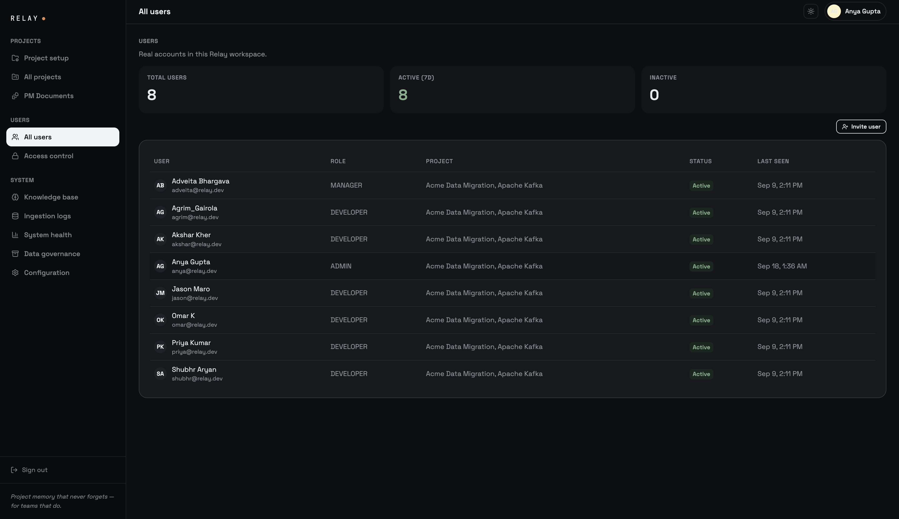
_All Users — every account in the workspace with role, assigned project(s), and last-active status._

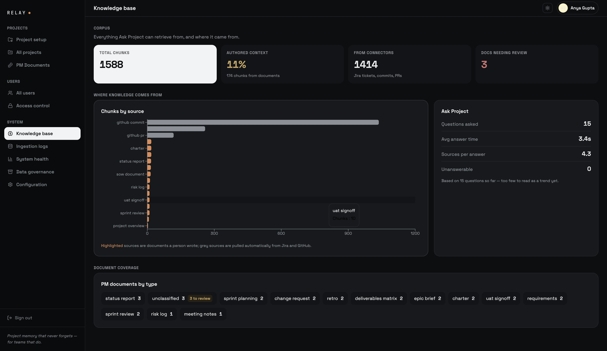
_Knowledge base — everything Ask Project can retrieve from and where it came from: total indexed chunks by source, PM document coverage by type, and Ask Project usage stats (questions asked, average answer time, sources per answer)._

## Known issues & limitations

- **Single live Jira/GitHub connection.** `backend/api/jira_client.py` and `github_client.py` are configured globally, not per-project — only one engagement has a real live sync today; every other project shows seeded/synthetic workspace data (`database/project_workspace_data.sql`) instead.
- **Render free-tier cold starts.** The backend sleeps after ~15 minutes idle; a cold start (re-loading the embedding model) takes 60–75 seconds. Mitigated by `.github/workflows/keepalive.yml` (pings every 10 minutes) and a prewarm ping fired from the login page — but a demo after a long idle gap can still hit a slow first request.
- **Frontend build tooling mismatch.** Local development uses `pnpm` (required — see Prerequisites), but `vercel.json`'s `installCommand`/`buildCommand` still invoke `bun`. Vercel's build runs in a clean container so this doesn't reproduce the local dev-server breakage, but it does mean Vercel's dependency resolution isn't guaranteed to match `pnpm-lock.yaml` exactly; worth aligning to `pnpm` in `vercel.json` as a follow-up.
- **No multi-project switcher.** A person staffed on more than one engagement always resolves to the first project they were assigned to (`src/lib/admin/useMyProject.ts`); switching between multiple active engagements isn't built yet.
- **Configuration page is read-only.** `/admin/config` displays connected sources and model configuration but isn't wired to change them — a placeholder for future admin control.
- **No GitHub integration UI**, despite GitHub being a live data source for sync/Ask Project — there's no connected-app flow, only a server-side token.

## Contributing / workflow

- `main` auto-deploys to production on every push — **never push directly to `main`.**
- All work happens on a feature branch: build → review/test locally → push the branch → open a PR → merge only once you're confident it won't break the deployed demo.
- Don't force-push shared history.
- See [`AGENTS.md`](AGENTS.md) for the full branching/deploy convention, and [`database/README.md`](database/README.md) before adding or changing anything under `database/`.

## License

No license file is currently included in this repository. This project is developed and maintained for the Relay Deloitte Capstone engagement; treat it as proprietary to that engagement's team and contributors unless a license is added.
